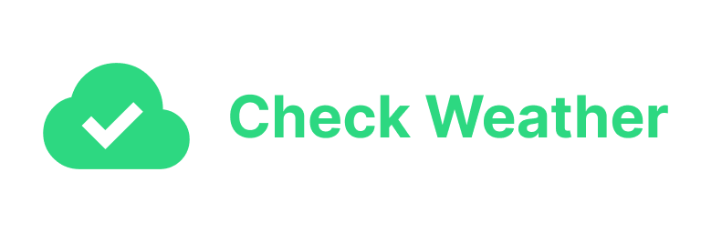

# Check Weather for Home Assistant

[![GitHub Release][gh-release-image]][gh-release-url]
[![GitHub Downloads][gh-downloads-image]][gh-downloads-url]
[![hacs][hacs-image]][hacs-url]
[![GitHub Sponsors][gh-sponsors-image]][gh-sponsors-url]
[![Patreon][patreon-image]][patreon-url]
[![Buy Me A Coffee][buymeacoffee-image]][buymeacoffee-url]
[![Twitter][twitter-image]][twitter-url]

[English](./readme.md) | [**Українською**](./readme.uk.md)

> [!NOTE]
> Простий бінарний сенсор для [Home Assistant][home-assistant], який перевіряє погоду на кілька наступних годин і вмикається, коли вона відповідає заданим умовам.

Ця інтеграція надає бінарний сенсор, який перевіряє погоду на кілька наступних годин і вмикається, коли вона відповідає заданим вами умовам.

Ідеї використання цього сенсора:

- **🚴‍♂️ День для велосипеда** — перевіряйте, чи достатньо добра погода для поїздки.
- **🚶 Погода для прогулянки** — перевіряйте, чи достатньо добра погода, щоб вийти на прогулянку.
- **☔️ Чи буде дощ** — перевіряйте, чи буде сьогодні дощ.

Сенсор можна перейменувати на будь-яку зрозумілішу для вас назву.

## Спонсорство

Ваша підтримка допоможе мені розвивати й підтримувати більше таких проєктів.

- 💖 [Стати спонсором на GitHub][gh-sponsors-url]
- ☕️ [Підтримати на Buy Me A Coffee][buymeacoffee-url]
- 🤝 [Підтримати на Patreon][patreon-url]
- Bitcoin: `bc1q7lfx6de8jrqt8mcds974l6nrsguhd6u30c6sg8`
- Ethereum: `0x6aF39C917359897ae6969Ad682C14110afe1a0a1`

## Встановлення

Найпростіше встановити інтеграцію через [HACS][hacs-url]:

[![Додати до HACS через My Home Assistant][hacs-install-image]][hacs-install-url]

  
Якщо кнопка не працює, додайте репозиторій вручну

1. Відкрийте **HACS** → **Інтеграції** → **...** (угорі праворуч) → **Користувацькі репозиторії**.
2. Натисніть **Додати**.
3. Вставте `https://github.com/denysdovhan/ha-check-weather` у поле **URL**.
4. Виберіть **Інтеграція** як **Категорію**.
5. **Перевірка погоди** з’явиться у списку доступних інтеграцій. Встановіть її звичайним способом.

## Використання

Інтеграція налаштовується через інтерфейс. Натисніть кнопку нижче, щоб додати її:

[![Додати Перевірку погоди][install-image]][install-url]

  
Якщо кнопка не працює, додайте інтеграцію вручну

1. На сторінці **Пристрої та служби** натисніть **Додати інтеграцію**.
2. Знайдіть **Перевірка погоди**.
3. Виконайте кроки налаштування інтеграції.

Задайте потрібні параметри:

Інтеграція створює нову сутність `binary_sensor`, яка вмикається, коли погода відповідає налаштованим умовам.

Сутність можна безпечно перейменувати на зрозумілішу назву, наприклад **День для велосипеда**.

## Переклади

Допоможіть додати нові або покращити наявні переклади. Підтримувані мови:

- English (англійська)
- Українська
- Polski (польська)
- Deutsch (німецька)
- Español (іспанська)
- [Ваша мова?][add-translation]

## Розробка

Хочете долучитися до проєкту?

Дякую! Докладніше читайте в [настановах для учасників](./contributing.md).

## Ліцензія

MIT © [Денис Довгань][denysdovhan]

<!-- Badges -->

[gh-release-url]: https://github.com/denysdovhan/ha-check-weather/releases/latest
[gh-release-image]: https://img.shields.io/github/v/release/denysdovhan/ha-check-weather?style=flat-square
[gh-downloads-url]: https://github.com/denysdovhan/ha-check-weather/releases
[gh-downloads-image]: https://img.shields.io/github/downloads/denysdovhan/ha-check-weather/total?style=flat-square
[hacs-url]: https://github.com/hacs/integration
[hacs-image]: https://img.shields.io/badge/hacs-default-orange.svg?style=flat-square
[gh-sponsors-url]: https://github.com/sponsors/denysdovhan
[gh-sponsors-image]: https://img.shields.io/github/sponsors/denysdovhan?style=flat-square
[patreon-url]: https://patreon.com/denysdovhan
[patreon-image]: https://img.shields.io/badge/support-patreon-F96854.svg?style=flat-square
[buymeacoffee-url]: https://buymeacoffee.com/denysdovhan
[buymeacoffee-image]: https://img.shields.io/badge/support-buymeacoffee-222222.svg?style=flat-square
[twitter-url]: https://twitter.com/denysdovhan
[twitter-image]: https://img.shields.io/badge/twitter-%40denysdovhan-00ACEE.svg?style=flat-square

<!-- References -->

[home-assistant]: https://www.home-assistant.io/
[denysdovhan]: https://github.com/denysdovhan
[hacs-install-url]: https://my.home-assistant.io/redirect/hacs_repository/?owner=denysdovhan&repository=ha-check-weather&category=integration
[hacs-install-image]: https://my.home-assistant.io/badges/hacs_repository.svg
[install-image]: https://my.home-assistant.io/badges/config_flow_start.svg
[install-url]: https://my.home-assistant.io/redirect/config_flow_start/?domain=check_weather
[add-translation]: https://github.com/denysdovhan/ha-check-weather/blob/master/contributing.md#how-to-add-translation
